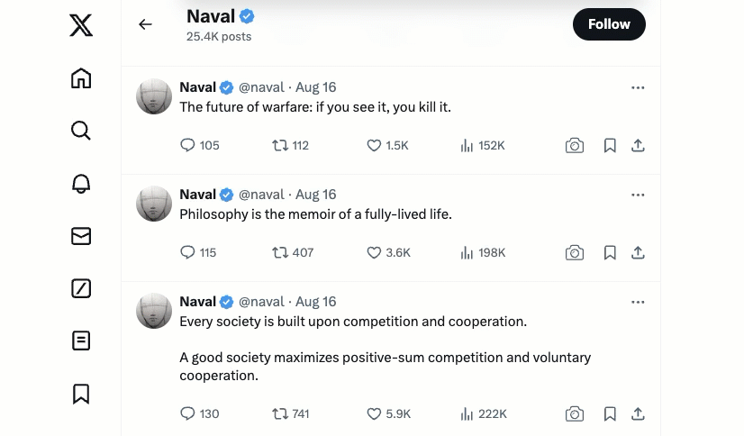

# Twitter Screenshots (X)

[**Twitter Screenshots**](https://chromewebstore.google.com/detail/twitter-screenshots/imfhndkgmnbnogfjcecdpopaooachgco) lets you take full-length screenshots of tweets on Twitter. The extension captures the entire tweet thread, even if it's a long conversation, and saves the screenshot as a PNG image on your computer.

Upon installation, the extension adds a "Take Screenshot" camera icon to each tweet. Clicking the button opens a new tab with the tweet and a high-quality screenshot of the tweet, served from Google Cloud Storage.

## Demo

### Google Developer

Twitter Screenshots is developed by [Amit Agarwal](https://www.labnol.org/about) 👋 for [Digital Inspiration](https://digitalinspiration.com/). He is Google Developer Expert for Google Workspace and Google Cloud Champion.
